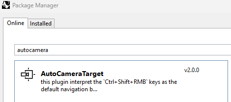

English version : https://discourse.mcneel.com/t/ctrl-shift-rmb-as-default

En attendant la version 8 et l'option `Rhino.Options.View.RotateViewAroundObjectAtMouseCursor`,
Voici un plugin qui positionne la cible de la caméra sur l'objet sous la souris afin d'interpréter le comportement `Ctrl+Shift+RMB`.


Installation
------------


Ce plugin est sur le serveur Yak et s'appelle `AutoCameraTarget` (La version actuelle est la 1.2.2).




Utilisation
-----------


Il n'y a qu'une seule commande: `ToggleAutoCameraTarget` avec trois options:
- `active` active ou non le positionnement automatique de la cible.
- `marker` affiche un point à l'emplacement de la cible.
- `debug`  affiche les éléments utilisés pour le calcul des intersections. (voir ci-dessous)


Vous pouvez activer le ciblage automatique de la caméra lorsque Rhino démarre avec la ligne de commande dans les paramètres: `Rhino Options > General > Command Lists`

```txt
ToggleAutoCameraTarget active=Yes marker=Yes _Enter
```

Le mode debug
-------------


Le mode débogage permet de visualiser l'intersection entre le curseur de la souris et les objets visibles de la vue.
Cela aide à comprendre comment fonctionne le calcul.

activé l'option `marker` et `debug`


<table>
<tr>
    <td> <b>Intersection sur un objet solide.</b>
    <td> 

<tr>
    <td> Ici, les arbres sont des fichiers liés en tant qu'instance de blocs. <br/>
         Mise en garde concernant les SubD, voir plus bas.
    <td> 

<tr>
    <td> <b>Intersection avec une boîte englobante.</b><br/> 
         Ici, vous avez cliqué à l'extérieur d'un objet solide.
    <td> 

<tr>
    <td> Les courbes ne sont pas des objets solides, <br/>
    seule la boîte englobante est utilisée pour trouver l'intersection.
    <td> 

<tr>
    <td> Le programme ne cherchera pas les courbes à l'intérieur des blocs. <br/>
    La boîte englobante du bloc sera utilisée.
    <td>
    
<tr>
    <td> Les intersections avec des courbes sont calculées uniquement s'il n'y a pas d'intersection avec des solides.
    <td>

<tr>
    <td>
        <b>Intersection avec une boîte renfermant tous les éléments visibles.</b>
    <td>
      
<tr>
    <td> 
        <b>Intersection avec le plan médian visible.</b> <br/>
        Ici, la position du curseur sera projetée sur le plan faisant face à la caméra et médian de la boîte contenant les éléments visibles de la vue.
    <td>

<tr>
    <td>
        <b>Aucune intersection possible</b> <br/>
        La dernière possibilité est lorsqu'il n'y a aucun objet visible dans la vue. <br/>
        Dans ce cas, le programme ne fait rien du tout et laisse la cible de la caméra inchangée.

</table>


Performance / Todo / Issues
---------------------------

Mention spéciale sur les objets SubD:
La fonction qui récupère les maillages d'objets est `RhinoObject.GetRenderMeshes`.
Son comportement est étrange avec les SubD : https://discourse.mcneel.com/t/rhinoobject-getrendermeshes-bug
Cela peut rendre l'utilisation de ce plugin désagréable lorsqu'il y a beaucoup d'objets de type SubD.

Actuellement, si un objet est partiellement visible, toute cette boîte englobante est utilisée pour le calcul de l'intersection. Pour les grands objets avec une très petite partie visible, cela peut entraîner une rotation excessive de la caméra.
peut-être est-il possible de limiter la boîte englobante de l'objet à la zone visible de l'écran...


Remarques techniques
--------------------

La méthode de sélection d'objets à l'aide d'une carte d'IDs permet de calculer plus rapidement les intersections et donc d'augmenter la fluidité de la navigation. Cependant, je n'ai pas trouvé d'implémentation appropriée avec l'API Rhino (voir https://discourse.mcneel.com/t/ids-buffer/152092). Sur ma machine, les gains de performances apparaissent lorsque le nombre de faces à tester devient supérieur à 1 million de faces.

- Pour 65 000 faces, le gain de `Parallel.For(Intersection.MeshRay)` est d'environ 33 % par rapport à `IdConduit`
- Pour 1.5 millions de faces, `IdConduit` est plus rapide que `Parallel.For(...)` d'environ 30% ou 40%.
- Pour 5.9 millions de faces, les valeurs ne changent pas, `IdConduit` est plus rapide de 30/40%.

Dans l'état actuel, le test à l'aide d'une carte d'IDs est désactivé.
Les cas où les objets sous le curseur de la souris créent plus d'un million de faces me semblent plutôt rares. `Parallel.For(Intersection.Mesh Ray)` fonctionne bien dans la plupart des cas.